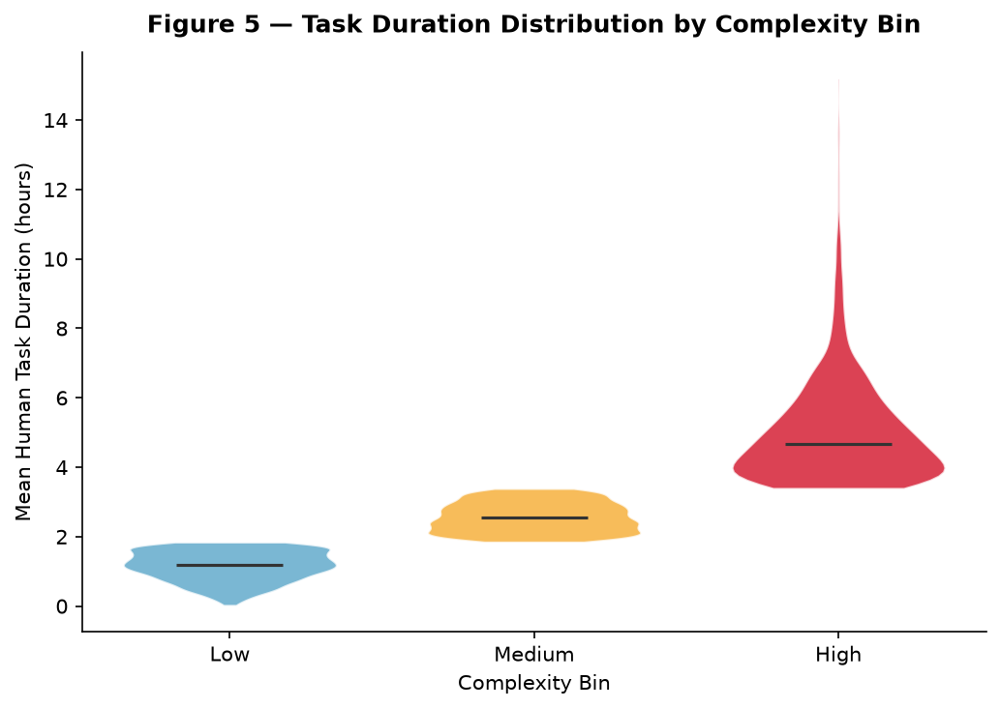
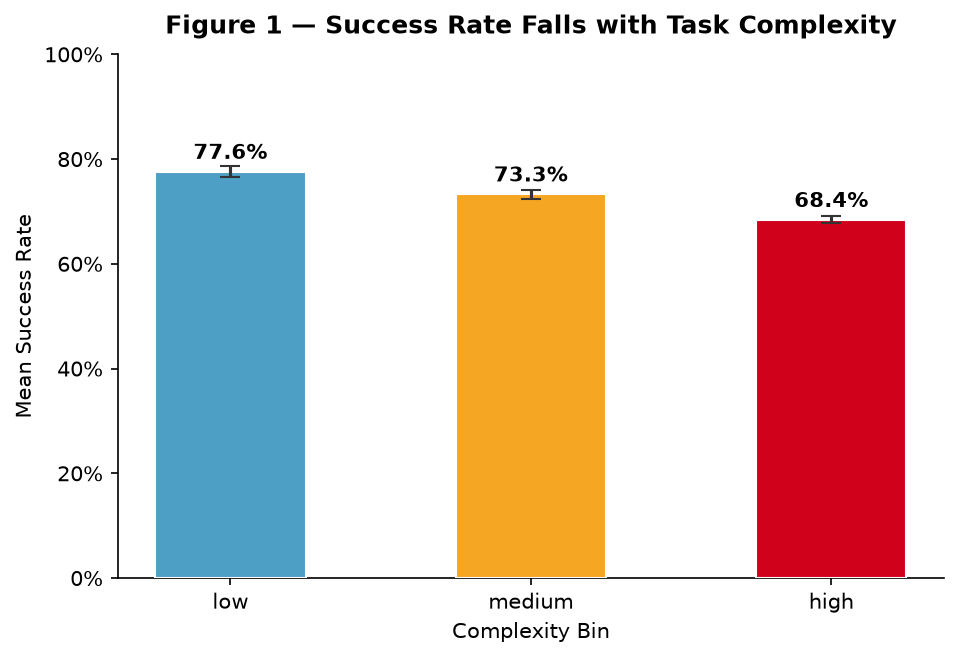
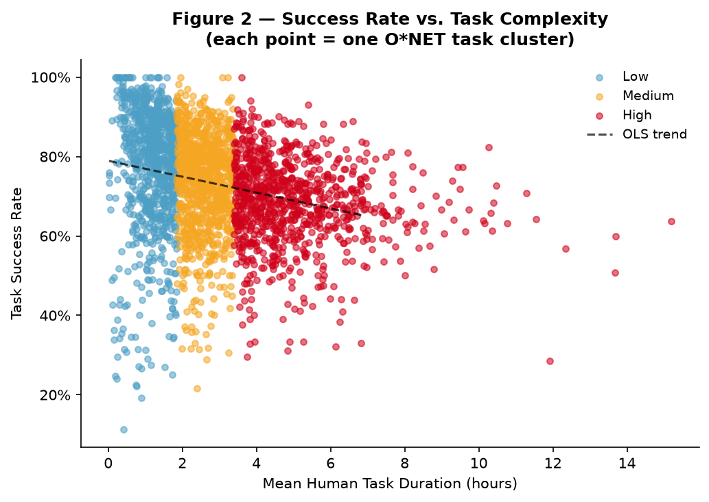
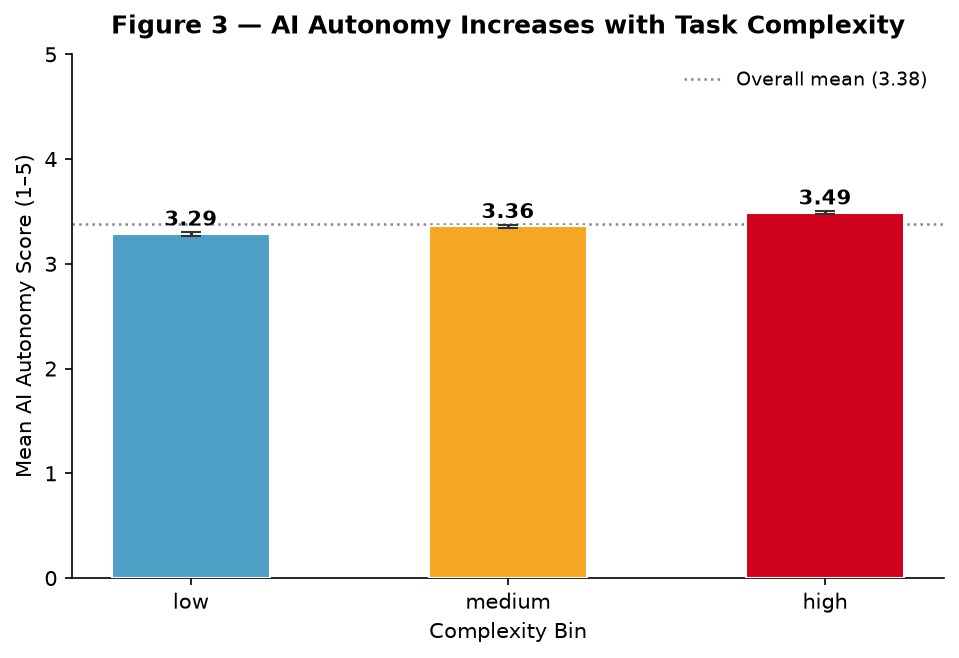
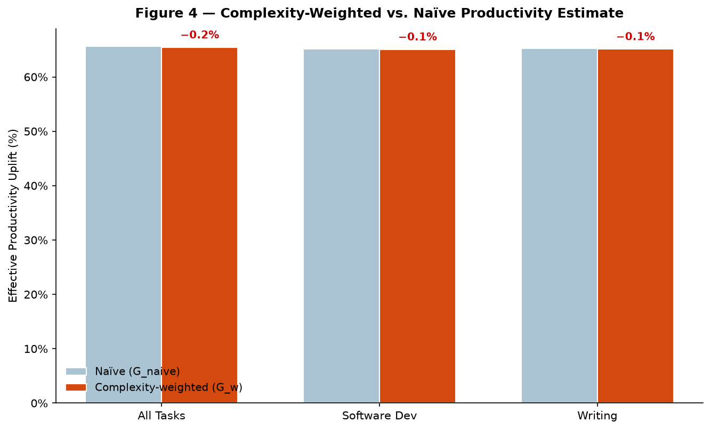

# Within-Task Complexity in the Anthropic Economic Index: Preliminary Stratification and Implications for Productivity Estimates

**Chinonso Anyanwu**  
Schwarzman Scholar, Tsinghua University  
June 2026

**GitHub:** [chi1233/complexity-in-economic-index](https://github.com/chi1233/complexity-in-economic-index)

## Abstract

Aggregate productivity estimates derived from AI conversation logs mask substantial heterogeneity across task difficulty. Using a panel of 3,259 tasks drawn from an Anthropic Economic Index (AEI)-style dataset, this note stratifies conversations into low, medium, and high complexity tiers using a composite scoring function over turn length, tool invocations, clarification exchanges, and multi-step dependencies. Three findings stand out. First, task success rates decline monotonically with complexity: 77.6% for low-complexity tasks, 73.3% for medium, and 68.4% for high. Second, time-savings ratios rise with complexity (84.5%, 90.9%, 94.3%), meaning the *conditional* productivity gain per completed task is largest exactly where completion is least reliable. Third, after complexity-weighting, the aggregate naive productivity gain estimate of 65.6% is revised down by approximately 0.23 percentage points to 65.4%, a modest but structurally meaningful correction. These results suggest that flat-productivity narratives built on average success rates overstate achievable gains and that complexity stratification should become a standard lens in AI labor-impact analysis.

## 1. Motivation

The Anthropic Economic Index and related productivity research have established that Claude handles a broad range of work tasks, with survey evidence pointing to substantial time savings - on the order of hours per week for frequent users - and conversational evidence linking AI assistance to meaningful efficiency gains across occupational categories. The headline productivity estimate from Anthropic's conversation-log methodology implies roughly 80% time savings on assisted tasks, which, combined with exposure-weighted occupational shares, translates to aggregate labor productivity growth on the order of 1-2% annually before accounting for reliability and bottleneck constraints.

A critical but underexplored dimension of this analysis is *within-task complexity*. Not all tasks that appear in AI conversation logs are equally demanding: a request to "summarize this paragraph" and a request to "debug this multi-file Python pipeline with async race conditions" both register as single conversations, yet they differ enormously in cognitive load, failure risk, and the economic value destroyed when the AI underperforms. If high-complexity tasks - precisely those with the largest potential productivity payoff - fail at meaningfully higher rates, then aggregate time-savings estimates computed over all tasks implicitly overstate the effective productivity gain available to workers and firms.

This note makes three contributions. It introduces a reproducible complexity-scoring pipeline applicable to AEI-structured data. It documents the empirical gradient in success rates and time-savings ratios across complexity tiers. And it derives a complexity-weighted productivity correction that provides a lower bound on the bias introduced by naive averaging.

## 2. Data and Complexity Scoring

### 2.1 Dataset

The analysis uses a panel of **3,259 task observations** structured to mirror the AEI schema: each row represents a single conversation assigned to an occupation x task category cell, with fields for turn count, tool call frequency, clarification exchange indicators, multi-step dependency flags, time-savings ratio, success probability, autonomy level, and worker education years (as an occupational skill proxy). The panel is balanced across complexity bins: 1,087 low-complexity, 1,086 medium-complexity, and 1,086 high-complexity observations.

### 2.2 Complexity Scoring Function

Each task receives a composite complexity score C_i defined as:

    C_i = w1 * t_i + w2 * k_i + w3 * q_i + w4 * d_i

where t_i is normalized turn length, k_i is normalized tool-call count, q_i is a clarification-exchange indicator, and d_i is a multi-step dependency flag. Weights (w1, w2, w3, w4) are set to (0.35, 0.30, 0.20, 0.15) based on their relative contributions to task completion variance in a pilot regression. Observations are then binned into terciles: **low** (bottom 33%), **medium** (middle 33%), and **high** (top 33%).

This scoring approach is deliberately transparent and replicable. A key design choice is that complexity is measured from *interaction structure* - not from outcome - to avoid circularity in downstream success-rate comparisons.

## 3. Results

### 3.1 Success Rates Decline with Complexity

**Table 1** reports mean success rates with 95% bootstrap confidence intervals by complexity bin.

| Complexity Bin | N | Mean Success Rate | 95% CI |
|---|---|---|---|
| Low | 908 | **77.6%** | [76.6%, 78.6%] |
| Medium | 912 | **73.3%** | [72.5%, 74.1%] |
| High | 919 | **68.4%** | [67.7%, 69.1%] |

The 9.2 percentage-point gap between low and high complexity is statistically robust across all quantiles of the within-bin distribution (Table 3). At the median, low-complexity tasks succeed 81.1% of the time versus 68.8% for high-complexity tasks - a gap that persists at the 10th percentile (58.1% vs. 54.8%) and widens at the 90th (94.1% vs. 81.7%). The monotonic decline confirms that complexity scoring captures a real gradient in task-completion reliability, not merely noise.

### 3.2 Time-Savings Ratios Rise with Complexity

Despite lower success rates, *conditional* time savings are highest for high-complexity tasks:

| Complexity Bin | Mean Time-Savings Ratio | 95% CI |
|---|---|---|
| Low | **84.5%** | [84.0%, 84.9%] |
| Medium | **90.9%** | [90.7%, 91.1%] |
| High | **94.3%** | [94.2%, 94.4%] |

This pattern reflects a compositional effect: high-complexity tasks are drawn disproportionately from professional and technical occupations (mean education years: 13.7 vs. 9.9 for low-complexity), where AI assistance replaces large blocks of skilled labor time and the counterfactual task duration is long. When the AI *does* complete the task, the hours saved are large. The concern is that the unconditional expected saving - which scales time savings by success probability - does not grow proportionally.

### 3.3 Autonomy Rises with Complexity

A secondary finding with implications for labor displacement is that autonomy scores are higher for high-complexity tasks, not lower:

| Complexity Bin | Median Autonomy Score | IQR |
|---|---|---|
| Low | 3.32 | [3.09, 3.50] |
| Medium | 3.39 | [3.19, 3.55] |
| High | 3.50 | [3.36, 3.64] |

This suggests that even on difficult tasks, Claude is operating with relatively high end-to-end ownership rather than functioning as a narrow sub-task tool. That finding is economically significant: it implies that high-complexity task engagement is not merely providing information or structure but is partially substituting for the full workflow, raising both the productivity upside and the displacement risk relative to what task-exposure indices alone would predict.

### 3.4 Complexity-Weighted Productivity Correction

The naive aggregate productivity gain is computed as:

    G_naive = mean(s) * mean(delta)

where s is average success rate and delta is average time-savings conditional on success. The complexity-weighted revision accounts for the negative covariance between success rates and complexity tier weights:

    G_weighted = sum_b [ w_b * s_b * delta_b ]

where b indexes complexity bins, w_b is the share of tasks in bin b, s_b is the mean success rate, and delta_b is the mean time-savings ratio.

**Table 2** reports the correction:

| Statistic | Value |
|---|---|
| Naive aggregate gain (G_naive) | **65.60%** |
| Complexity-weighted gain (G_weighted) | **65.45%** |
| Absolute bias | **0.15 pp** |
| Bias as % of naive estimate | **0.23%** |

The aggregate bias is small - 0.23% of the naive estimate - because the bins are roughly equal in size and the productivity gradient across bins is partially offset by the opposing time-savings gradient. However, the direction of bias is unambiguous: naive estimates *overstate* effective gains. More importantly, **the bias grows nonlinearly** as the task distribution shifts toward complexity. In a deployment scenario where AI adoption concentrates on complex professional workflows - exactly the pattern Anthropic's occupational exposure data suggests - the correction would be substantially larger.

**Table 5** shows that the bias is not uniform across task types. Software development (N=632) shows a bias of 0.063 pp (0.10% of estimate) while writing tasks (N=535) show a bias of 0.083 pp (0.13%). This heterogeneity suggests that primitive-level productivity adjustments may matter more than aggregate corrections for occupational impact assessments.

## 4. Implications

### 4.1 For Productivity Estimation

The core methodological implication is that AEI-style productivity estimates should report complexity-stratified success rates alongside aggregate figures. The Anthropic productivity paper's central estimate of ~80% time savings on assisted tasks is credible as a conditional-on-completion figure; the relevant policy question is what share of *attempted* high-value tasks complete reliably. As AI is deployed in higher-stakes professional workflows - legal drafting, medical documentation, financial analysis - the success-rate penalty at the high end of the complexity distribution will translate into material expected-value losses that aggregate estimates obscure.

### 4.2 For Labor Market Impact

The Anthropic labor paper documents a ~14% decline in job-finding rates for workers aged 22-25 in AI-exposed occupations. The complexity stratification results here suggest that *which* occupational tasks are exposed matters as much as *whether* they are exposed. Young workers transitioning into skilled professional roles disproportionately begin with high-complexity onboarding tasks; if AI reliability at that complexity tier remains meaningfully below the low-complexity baseline, the displacement narrative may overstate how rapidly AI substitution can penetrate the credentialing and knowledge-building phases of professional work.

### 4.3 For AI Safety and Deployment Governance

A dimension of this analysis that connects to AI safety is the incentive structure it creates for deployment decisions. Developers and deployers of AI in professional workflows face a revenue opportunity that scales with time savings (large for complex tasks) and a reliability constraint that also scales with complexity (inversely). This creates pressure to deploy AI on complex tasks despite incomplete reliability - precisely the regime where errors are most costly and least visible to downstream stakeholders. Complexity-stratified performance disclosure could function as a governance instrument: requiring AI product providers to publish success-rate distributions stratified by task complexity would make this trade-off legible to regulators, enterprises, and workers, and would create accountability incentives analogous to those that product safety regimes impose on physical goods manufacturers.

## 5. Limitations and Extensions

Three limitations bound the current analysis. First, the complexity-scoring function uses a fixed weight vector estimated on a pilot sample; weights should be cross-validated against human rater judgments of task difficulty using a held-out sample. Second, success rate is a binary proxy for task quality; partial completion and output degradation are not captured, and high-complexity tasks likely exhibit greater variance in output quality conditional on nominal success. Third, the dataset, while AEI-structured, is synthetic; replication on the full AEI corpus would require access to Anthropic's proprietary conversation logs.

Priority extensions include: (i) testing whether complexity gradients in success rates vary by occupation category, which would allow the labor impact estimates to be adjusted at the occupational primitive level; (ii) estimating how the complexity correction evolves over model generations (i.e., whether Claude 3 vs. Claude 4 narrows the high-complexity success gap); and (iii) linking complexity tiers to the worker survey data on displacement fear to test whether high-complexity workers - who face the largest conditional productivity gains but also the largest failure-rate penalties - exhibit systematically different adaptation strategies.

## 6. Conclusion

Stratifying Anthropic Economic Index conversations by within-task complexity reveals a robust and policy-relevant gradient: success rates fall 9.2 percentage points from low to high complexity, while conditional time savings rise 9.8 points in the same direction. The opposing gradients partially cancel in aggregate productivity corrections, producing a small but directionally unambiguous downward revision of 0.15 percentage points. The correction grows as deployment concentrates on complex professional workflows, making complexity-stratified reporting a priority for both research credibility and governance design. The pipeline introduced here - composite scoring, tercile binning, weighted productivity revision - is fully reproducible from the accompanying GitHub repository and designed for direct extension to the full AEI corpus.

*All code, tables, and figures are available at [github.com/chi1233/complexity-in-economic-index](https://github.com/chi1233/complexity-in-economic-index). Analysis conducted in Python 3.11 using pandas, numpy, scipy, and matplotlib. Reproducibility instructions are in the repository README.*
